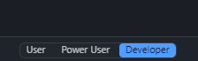
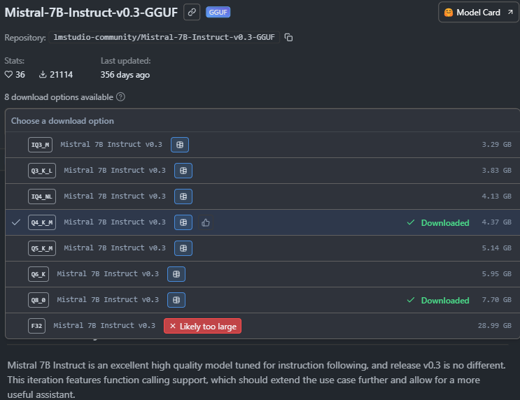
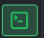
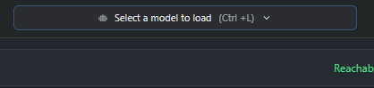
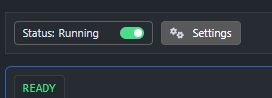
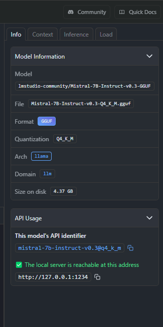

# PsyBot

## Requisiti

- Python 3.13.3 -> https://www.python.org/downloads/release/python-3133/

- LM Studio -> https://lmstudio.ai/

- Tutte le dipendenze in `requirements.txt`

- Cartella `docs/`

## Come avviare
Prima di tutto avviare LM studio e in basso a sinistra si presenteranno 3 voci, ovvero:
    - User
    - Power user
    - Developer

    
Selezionare Developer.

Successivamente dirigersi nella ricerca del modello ( in alto a sinistra c'è l'icona di una lente di ingrandimento). 

Cercare: 
    Mistral-7B-Instruct-v0.3-GGUF    

    
Selezionare nel menù a tendina la quantizzazione  desiderata (più è alta la quantizzazione più è preciso il modello, ma anche più lento)

    

si consiglia la versione q4_k_m o superiori a seconda delle componenti.

Una volta installato dirigetsi nell'icona (sempre in alto a sinistra) che rappresenta un terminale (Developer).

Quando siamo dentro alla pagina Developer selezionare in alto al centro il modello che abbiamo scelto.

Troviamo poi uno Switch in alto a sinistra e dobbiamo settarlo a ON in modo tale che il server "starti", aspettiamo che lo start sia avvenuto.

Quando abbiamo selezionato il modello ci si aprirà una tendina a destra con le informazioni del modello, se l'ip è diverso da quello attualmente inserito in app.py (riga 21) sostituire solo l'ip.

LM_API_URL = "http://127.0.0.1:1234/v1/chat/completions" 

--------------------------------------------------------------------------------------------------------------------------------------------------------------------------

Adesso siamo pronti per passare alla parte bash o vscode.

bash o vscode:

Una volta aperto bash entrare nella cartella del progetto e inserire il comando:
    pip install -r requirements.txt

Se vi sono ancora warning per librerie e dipendenze allora usare il comando:
    python -m pip install -r requirements.txt

Una volta finita l'installazione dei requirements siamo pronti ad avviare il server tramite il comando:
    python app.py

Ci troveremo nell'interfaccia Gradio dopo che avremo cliccato sul localhost fornito dal terminale.

Per concludere con l'utilizzo del chatbot torniamo sul terminale e clicchiamo CTRL+C, successivamente andiamo su LM Studio e stoppiamo il server.

